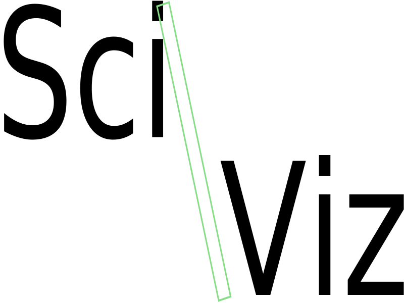

# sci-viz


Generic visualization framework for building dashboarding capabilities for DataJoint pipelines.

## Installation
If you have not done so already, please install the following dependencies:

- [Docker](https://docs.docker.com/get-docker/)
- [Docker Compose](https://docs.docker.com/compose/install/)

## Prerequisites
Before running the application through docker, make sure to run the command:
```bash
python frontend_gen.py
```
This will compile the necessary typescript files for the frontend.
you can also run this at any time during a dev deployment to hot-load the frontend, however this is not always guaranteed to work as some changes may require the entire react server to restart. Anything related to the back end api is not hot-loadable but for example the component locations and sizes can be modified and hot-loaded.

## Running the application
To start the application in dev mode, use the command:
```bash
PY_VER=3.8 IMAGE=djbase DISTRO=alpine PHARUS_VERSION=$(cat pharus/pharus/version.py | tail -1 | awk -F\' '{print $2}') HOST_UID=$(id -u) docker-compose up --build
```

To stop the application, use the command:
```bash
PY_VER=3.8 IMAGE=djbase DISTRO=alpine PHARUS_VERSION=$(cat pharus/pharus/version.py | tail -1 | awk -F\' '{print $2}') HOST_UID=$(id -u) docker-compose down
```

## Dynamic spec sheet
Sci-Vis is used to build visualization dashboards, this is done through a single spec sheet. An example spec sheet is included named `example_visualization_spec.yaml`

Important notes about restrictions in the spec sheet:
- Page names under pages must have a unique name without spaces
- Page routes must be unique
- Grid names under grids must be unique without spaces
- Component names under components must be unique without spaces
- The routes of individual components must be unique
- Routes must start with a `/`
- Every query needs a restriction, below is the default one.
  - ```python
        def restriction(**kwargs):
            return dict(**kwargs)
    ```
- Overlapping components at the same (x, y) does not work, the grid system will not allow overlapping components it will wrap them horizontally if there is enough space or bump them down to the next row.

If the website does not work after running frontend generation script check this list to make sure that spec sheet is constructed properly, in the future we may include a script that lints the spec sheet for you see issue [#20](https://github.com/datajoint/sci-viz/issues/20)
## DEV
There are a couple issues to address if you are collaborating on this project
- devs will have have to point the submodule to their own fork of pharus if they need to edit pharus to support new features for sci-viz.
- That change to pharus would need to be pr'd and then merged into pharus before we can pr and merge their change to sci-viz as we probably dont want unreviewed code linked to sci-viz nor do we want the submodule pointing to their fork of pharus.
## References
- DataJoint
  - https://datajoint.io
- Pharus (a DataJoint REST API backend):
  - https://github.com/datajoint/pharus